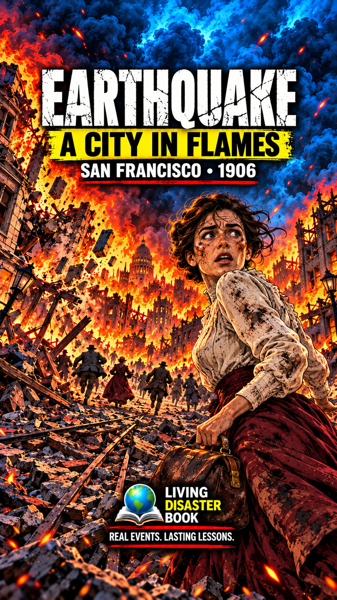

# Approved Thumbnail Design No. 4 — Looking Back — Escape

Approved by REN. Sample event: San Francisco Earthquake & Fire — California, USA — 1906.

## Approved reference prompt

Create a high-impact Living Disaster Book thumbnail for San Francisco Earthquake & Fire — California, USA — 1906, portrait 9:16. APPROVED DESIGN No. 4: LOOKING BACK — ESCAPE. Full-color mature historical anime / graphic-novel illustration with detailed hand-inked outlines, electric blue smoke and shadows contrasted with orange-scarlet fire. One adult woman about 30 in the RIGHT foreground, moving toward the viewer in a three-quarter turn and looking back over her shoulder toward collapsing buildings on the LEFT. Full head and expressive face visible, dark pinned hair with loose strands, soot-marked high-neck ivory long-sleeved blouse, burgundy ankle-length walking skirt, small worn leather travel bag, historically appropriate to 1906. Natural anatomy and readable fear. On the left: collapsing period masonry, broken streetcar rails, rubble and small adult evacuees; strong depth into a burning San Francisco street. No fantasy chasm. Crop-safe composition: generous nonessential smoke above and rubble below; keep all lettering, full head and branding comfortably inset from every edge. White cracked headline: EARTHQUAKE. Yellow strip with black text: A CITY IN FLAMES. White location/year: SAN FRANCISCO • 1906, with restrained red underline. Centered lower branding with small globe/open-book icon: LIVING DISASTER BOOK. Tagline: REAL EVENTS. LASTING LESSONS. Bold mobile-readable typography. No modern objects, minors, gore, invented casualty figures, UI, watermark or clipped text. Finished thumbnail only.

## Reuse

The design selector adapts this composition to the current topic. The sample image and copy-reference button remain specific to San Francisco 1906; do not reuse its fire or buildings for unrelated events.
